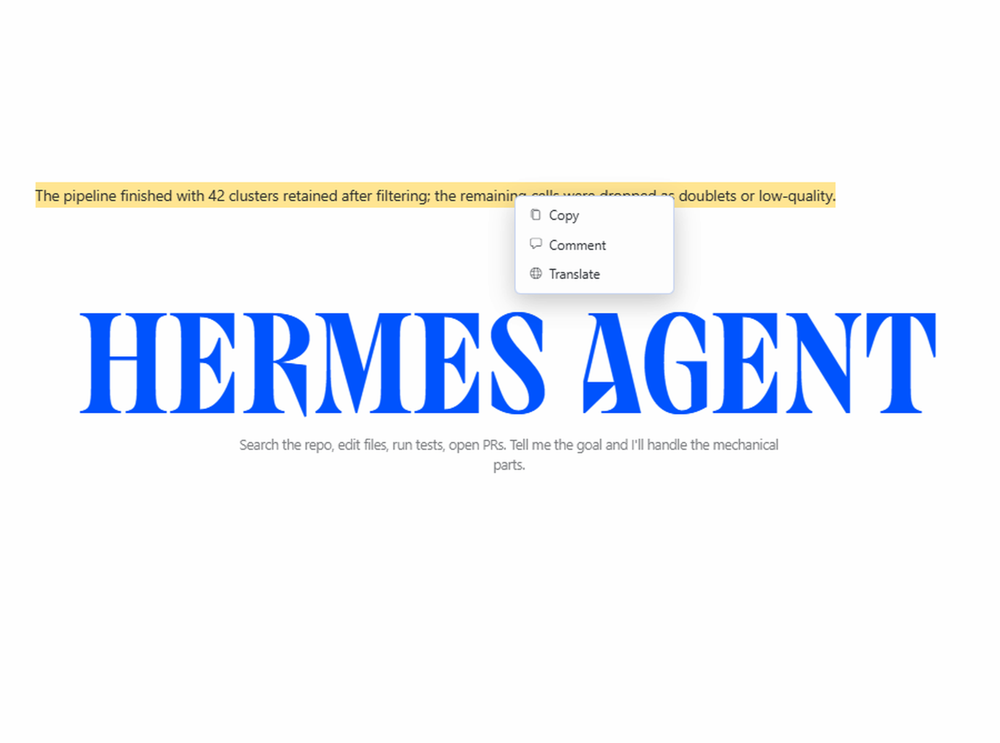
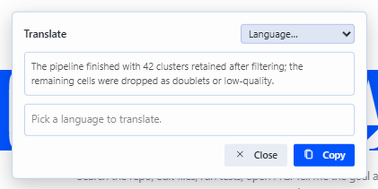

# hermes-translate

A desktop plugin for [Hermes Agent](https://hermes-agent.nousresearch.com/) that translates any selected passage — a paragraph of a response, a sentence you did not follow — without leaving the app or pasting into another tool. Your last target language is remembered, so the second use is one click.





## What it does

- **Right-click a selection → Translate.** A popup shows the source text, a language picker (13 common targets plus *Custom…* for anything else), and the result.
- **Remembers the language.** Pick Chinese (Simplified) once; every later popup opens, translates immediately, and shows the result. Change the language any time from the same picker — the choice is stored with the plugin (`hermes.plugin.translate.target_language`).
- **Copy** puts the translation on the clipboard; **Close** (or Escape) dismisses the popup.
- **Works alone or alongside [`hermes-quote-comment`](https://github.com/pwwang/hermes-quote-comment).** If that plugin is installed and enabled, Translate appears as a row inside its single context menu (Copy / Comment / Translate). If not, this plugin opens its own menu with Copy / Translate. Either way you get exactly one menu per right-click.

## Installation

1. Create the plugin folder (the folder name must match the plugin id):

   ```bash
   # Windows: %USERPROFILE%\.hermes\desktop-plugins\translate\
   # macOS / Linux: ~/.hermes/desktop-plugins/translate/
   mkdir -p ~/.hermes/desktop-plugins/translate
   ```

2. Copy `plugin.js` into it:

   ```bash
   cp plugin.js ~/.hermes/desktop-plugins/translate/
   ```

3. In the Hermes desktop app, open the command palette (⌘K / Ctrl+K) → **Reload desktop plugins**.

## Usage

1. Select the text you want translated.
2. Right-click → **Translate**.
3. Choose a target language the first time. The translation appears in the popup.
4. Copy it, or close the popup and keep reading.

## How it works

A single-file plugin for the [Hermes Desktop Plugin SDK](https://hermes-agent.nousresearch.com/docs/developer-guide/desktop-plugin-sdk) — no build step, no dependencies beyond the SDK.

- The translation itself is a gateway JSON-RPC call, `llm.oneshot`, with a translation instruction and the selected text. When a chat is focused, its `session_id` is passed so the call is billed and routed through that session's own model; the plugin sends a private `session_id`-less call only when there is no focused session.
- Model access therefore requires **no API key of its own** — it uses whatever model and provider you have configured in Hermes.
- Menu integration uses the extension contract published by `hermes-quote-comment` (`globalThis.__hermes_message_menu_ext`), re-registering the row on every right-click so it survives hot reloads. If that host is missing — or present but not producing a menu — the plugin falls back to its own menu after a short check, so the gesture never silently does nothing.
- Stale responses are dropped: every request carries a sequence check, so switching language mid-flight cannot leave an old translation on screen.

### Known limitation

The session-less fallback path (no chat focused) is rejected by some providers. With OpenCode Go, for example, the call fails with:

```
MissingSessionID … Request is missing x-opencode-session and cannot be routed efficiently
```

Selecting text inside a session — the normal case — passes the session id and works. If you only ever see this error, translate from within an open session, or open an issue; it is a provider-integration gap in `llm.oneshot`, not a plugin setting.

## Requirements

- Hermes desktop app (the plugin system is desktop-only; the CLI/gateway does not load desktop plugins).
- A Hermes build with the desktop plugin SDK (`@hermes/plugin-sdk`).
- A configured model provider (the plugin borrows it; it has no key of its own).

## Uninstall

Delete the `translate` folder from `desktop-plugins/` and reload plugins. You can also disable the plugin from **Settings → Plugins** without deleting it.

## License

[MIT](LICENSE)
